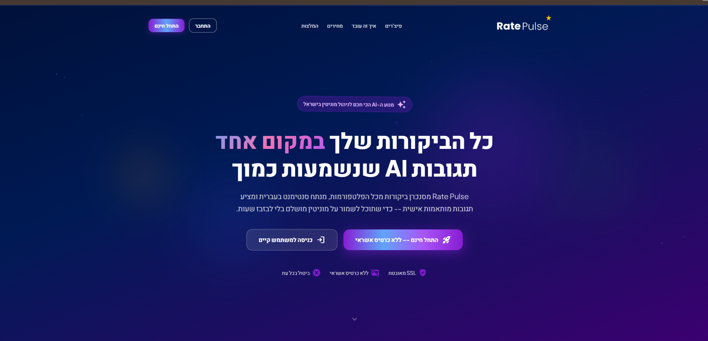
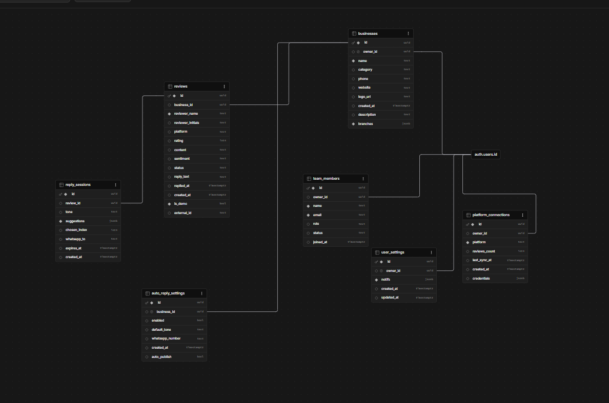
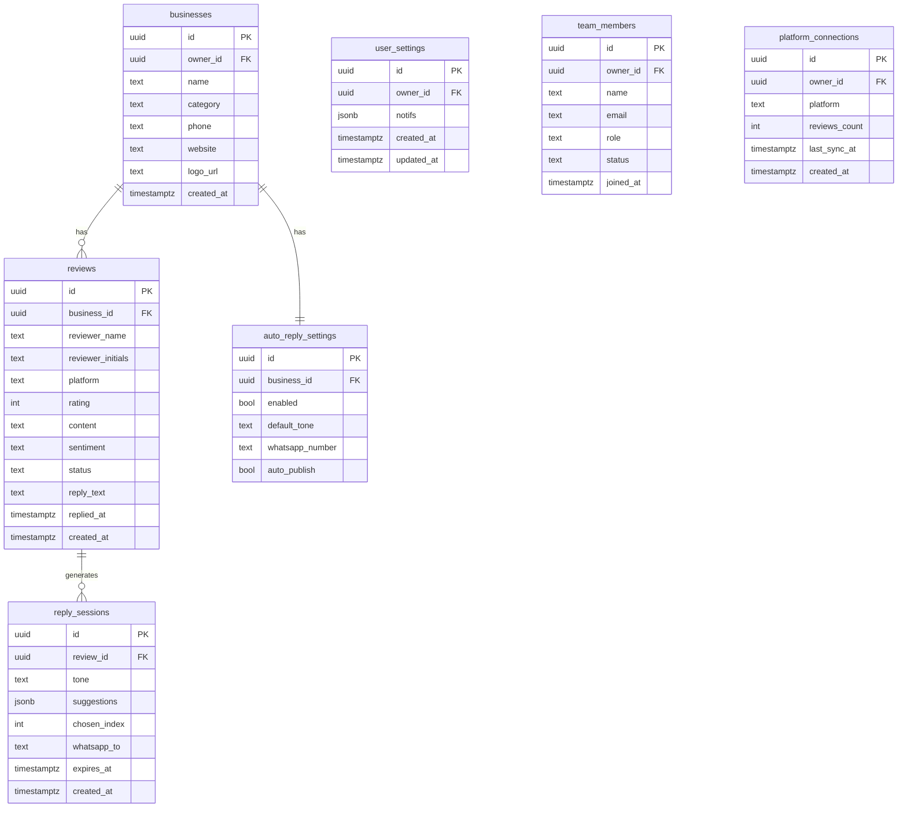

<h1 align="center">Rate Pulse - ניהול מוניטין חכם</h1>

> פלטפורמת SaaS לעסקים ישראלים: מרכזת ביקורות מכל הפלטפורמות, מנתחת מגמות ורגישות בזמן אמת, ומייצרת תשובות בעברית בעזרת AI.

---

## סקירה כללית

Rate Pulse מאגדת את כל הביקורות של העסק לדשבורד אחד, מסווגת אותן לפי סוג הביקורת, ומציעה 4 תשובות מותאמות בעברית שנוצרות על-ידי Claude AI. בלחיצה אחת בוחרים תשובה ומפרסמים.
המערכת מאפשרת להגדיר את הסגנון שבו תבחר להגיב (מתנצל, רך, תקיף וכ"ו)
באפשרותך לבחור שהמערכת שתגיב במקומך לכל ביקורת ע"פ הסגנון שסימנת או
לחלופין לקבל לטלפון באמצעות ווטסאפ 4 תגובות מוצעות ע"י הבינה המלכותית ואתה
תבחר איזה הודעה תשלח.

---

## הבעיה שאנחנו פותרים

בעלי עסקים קטנים ובינוניים מקבלים ביקורות ב-3-5 פלטפורמות שונות. הם מתחלקים בין אפליקציות, בעלי העסקים לרוב עסוקים מאוד ולא מוצאים את הזמן לענות (במיוחד לביקורות שליליות), ומבזבזים שעות על ניסוח תשובות מנומסות בעברית - שלרוב נכתבות מחדש בכל פעם. תגובה איטית לביקורת שלילית פוגעת בדירוג ובאמון הלקוח.

---

## קהל היעד

עסקים ישראלים קטנים-בינוניים עם נוכחות דיגיטלית ב-2+ פלטפורמות:

- **מסעדות וקפה** - תנועת ביקורות גבוהה, שעות שיא עמוסות, צורך בתגובה מהירה
- **סלוני יופי וספרים** - לקוחות חוזרים, מוניטין אישי רגיש
- **בתי מלון ו-Airbnb** - ציון ממוצע משפיע ישירות על הכנסות
- **רשתות קמעונאיות קטנות** - כמה סניפים, צוות מנהל מרכזי
- **כל עסק קטן או בינוני שיש לו דף עסק באחת מהפלטפורמות.**

טריגר שימוש: "קיבלתי ביקורת 1 כוכב בגוגל, לא ראיתי אותה שבועיים, ולקוחות אחרים כבר ראו את הביקורת השלילית שממתינה ללא תגובה ולכן הם הלכו למתחרה שלי."

---

## מתחרים ובידול

| פתרון קיים | מה חסר בו |
|---|---|
| **ניהול ידני** (לפתוח כל אפ בנפרד) | בזבוז זמן, פספוס ביקורות, אין ניתוח |
| **וואטסאפ / אקסל** למעקב | לא מחובר לפלטפורמות, לא מדרג |
| **Birdeye / Podium** (גלובלי) | לא תומך בעברית ו-RTL, יקר ($300+/mo), ממשק באנגלית |
| **Grade.us / ReviewTrackers** | ממוצא צפון-אמריקאי, לא פונה לקהל הישראלי, ללא AI בעברית |

**הבידול שלנו:**
- **עברית-ראשונה** - כל ה-UI, הניתוח, ותשובות ה-AI בעברית RTL מלא
- **קהל ישראלי** - אינטגרציה לפלטפורמה שאין למתחרים
- **מענה בסגנון שלי** - 4 תשובות עם בחירת טון (עדין / אמפתי / תקיף / מתנצל)
- **WhatsApp loop** - מקבל ביקורת, בוחר תשובה בוואטסאפ, מפרסם אוטומטית
- **מחיר ישראלי** - ₪149/חודש לעומת $300+ למתחרים הגלובליים

---

## Live Demo

🔗 **[rate-pulse.vercel.app](https://rate-pulse.vercel.app)**

> **בדיקה מהירה:** בדף הכניסה לחצו על **"מעבר לגירסת הדמו"** - ללא צורך בהרשמה.

---

## מבנה הדפים

| Route | תיאור |
|-------|--------|
| `/dashboard` | KPI cards, גרף סנטימנט, pulse gauge, ביקורות אחרונות |
| `/reviews` | רשת ביקורות עם סינון לפי פלטפורמה / סנטימנט / סטטוס |
| `/analytics` | ניתוח 3/6/12 חודשים, פיזור דירוגים, ביצועי פלטפורמות |
| `/reports` | יצירת דוחות שבועיים / חודשיים / שנתיים (PDF / Excel / CSV) |
| `/onboarding` | אשף הגדרה ב-4 שלבים לעסקים חדשים |
| `/settings` | פרופיל, התראות, חיבורי פלטפורמות, ניהול צוות, חיוב |
| `/auth/login` | כניסה |
| `/auth/register` | הרשמה |

---

## ERD - מודל נתונים (Supabase / PostgreSQL)

---

## שירותים חיצוניים ואינטגרציות

| שירות | שימוש | משתני סביבה |
|--------|--------|-------------|
| **Supabase** | PostgreSQL + Auth + RLS + Edge Functions | `VITE_SUPABASE_URL`, `VITE_SUPABASE_ANON_KEY` |
| **Anthropic Claude** (`claude-sonnet-4-6`) | יצירת 4 תשובות AI בעברית לפי טון הביקורת | `ANTHROPIC_API_KEY` |
| **GREEN API** | שליחת ביקורות ותשובות מוצעות ב-WhatsApp Business | `GREEN_API_INSTANCE_ID`, `GREEN_API_TOKEN` |
| **Google Business Profile** | שליפת ביקורות Google | OAuth / API Key |
| **Google OAuth** | אוטנטיקציה - התחברות משתמשים דרך חשבון גוגל | `GOOGLE_CLIENT_ID`, `GOOGLE_CLIENT_SECRET` |
| **Facebook Pages API** | שליפת ביקורות Facebook | `FB_ACCESS_TOKEN` |
| **TripAdvisor API** | שליפת ביקורות TripAdvisor | `TRIPADVISOR_KEY` |
| **Vercel** | Hosting ו-CI/CD לצד הלקוח | — |

---

## Stack

| Layer | Tech |
|-------|------|
| Frontend | React 19 + TypeScript + Vite + TailwindCSS v4 |
| Backend | Supabase (PostgreSQL + Auth + RLS) |
| Serverless | Supabase Edge Functions (Deno) |
| AI | Claude API (`claude-sonnet-4-6`) |
| Charts | Recharts |
| Deploy | Vercel + Supabase Cloud |

---

## תמחור

| תוכנית | מחיר | ביקורות | AI תשובות | פלטפורמות | משתמשים |
|--------|------|---------|-----------|-----------|---------|
| Free | ₪0 | 100/חודש | 30 | 1 | 1 |
| בעתיד - Pro | ₪149/חודש | ללא הגבלה | ללא הגבלה | כל | 5 |
| בעתיד - Enterprise | ₪399/חודש | ללא הגבלה | ללא הגבלה | כל + API | ללא הגבלה |

---

