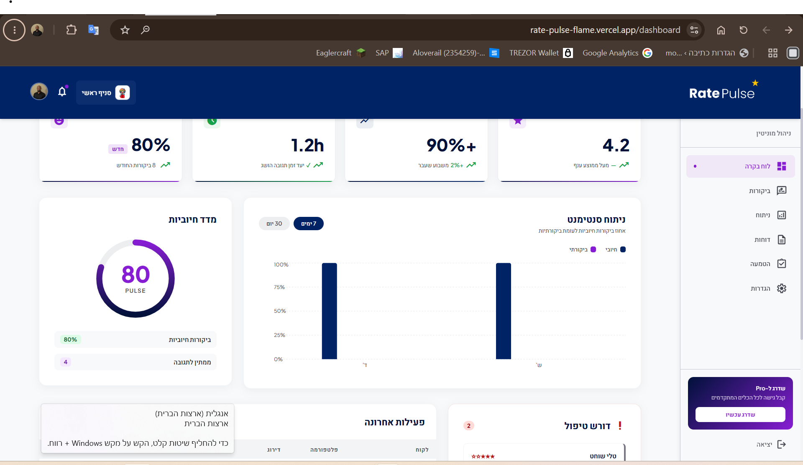
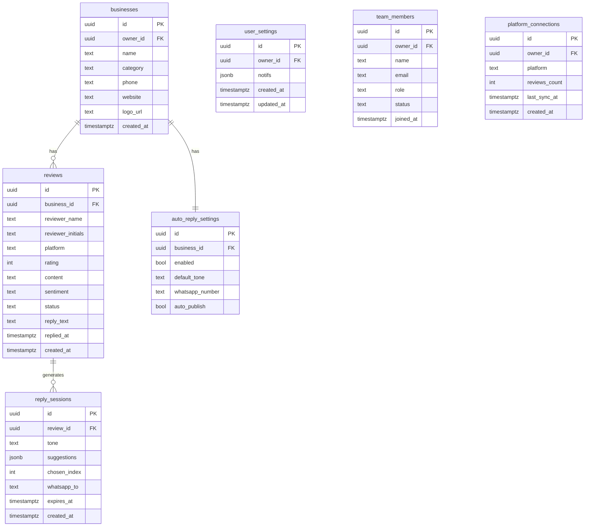

<div dir="rtl">

# Rate Pulse — ניהול מוניטין חכם

> פלטפורמת SaaS לעסקים ישראלים: מרכזת ביקורות מכל הפלטפורמות, מנתחת סנטימנט בזמן אמת, ומייצרת תשובות בעברית בעזרת AI.

---

## סקירה כללית

Rate Pulse מאגדת את כל הביקורות של העסק — Google, Facebook, TripAdvisor - לדשבורד אחד, מסווגת אותן לפי סנטימנט, ומציעה 4 תשובות מותאמות-טון בעברית שנוצרות על-ידי Claude AI. בלחיצה אחת בוחרים תשובה ומפרסמים.

---

## הבעיה שאנחנו פותרים

בעלי עסקים קטנים ובינוניים מקבלים ביקורות ב-3–5 פלטפורמות שונות. הם מתחלקים בין אפליקציות, שוכחים לענות (במיוחד לביקורות שליליות), ומבזבזים שעות על ניסוח תשובות מנומסות בעברית — שלרוב נכתבות מחדש בכל פעם. תגובה איטית לביקורת שלילית פוגעת בדירוג ובאמון הלקוח.

---

## קהל היעד

עסקים ישראלים קטנים-בינוניים עם נוכחות דיגיטלית ב-2+ פלטפורמות:

- **מסעדות וקפה** — תנועת ביקורות גבוהה, שעות שיא עמוסות, צורך בתגובה מהירה
- **סלוני יופי וספרים** — לקוחות חוזרים, מוניטין אישי רגיש
- **בתי מלון ו-Airbnb** — ציון ממוצע משפיע ישירות על הכנסות
- **רשתות קמעונאיות קטנות** — כמה סניפים, צוות מנהל מרכזי

טריגר שימוש: "קיבלתי ביקורת 1 כוכב בגוגל, לא ראיתי אותה שבועיים, המתחרה שלי ענה תוך שעה."

---

## מתחרים ובידול

| פתרון קיים | מה חסר בו |
|---|---|
| **ניהול ידני** (לפתוח כל אפ בנפרד) | בזבוז זמן, פספוס ביקורות, אין ניתוח |
| **וואטסאפ / אקסל** למעקב | לא מחובר לפלטפורמות, לא מדרג |
| **Birdeye / Podium** (גלובלי) | לא תומך בעברית ו-RTL, יקר ($300+/mo), ממשק באנגלית |
| **Grade.us / ReviewTrackers** | ממוצא צפון-אמריקאי, ללא Wolt/ישראלי, ללא AI בעברית |

**הבידול שלנו:**
- **עברית-ראשונה** — כל ה-UI, הניתוח, ותשובות ה-AI בעברית RTL מלא
- **Wolt + ישראל** — אינטגרציה לפלטפורמה שאין למתחרים
- **AI בטון** — 4 תשובות עם בחירת טון (עדין / אמפתי / תקיף / מתנצל)
- **WhatsApp loop** — מקבל ביקורת, בוחר תשובה בוואטסאפ, מפרסם אוטומטית
- **מחיר ישראלי** — ₪149/חודש לעומת $300+ למתחרים הגלובליים

---

## Live Demo

🔗 **[rate-pulse.vercel.app](https://rate-pulse.vercel.app)**

> **בדיקה מהירה:** בדף הכניסה לחצו על **"מעבר לגירסת הדמו"** — ללא צורך בהרשמה.



---

## הרצה מקומית

### דרישות מקדימות

- Node.js 20+
- חשבון [Supabase](https://supabase.com) (חינמי)
- מפתח API של [Anthropic](https://console.anthropic.com) לתשובות AI
- (אופציונלי) חשבון [GREEN API](https://green-api.com) לאינטגרציית WhatsApp

### 1. Clone & Install

```bash
git clone https://github.com/noamhadary/Rate-Pulse.git
cd Rate-Pulse
npm install
```

### 2. הגדרת משתני סביבה

```bash
cp .env.example .env.local
```

ערכו את `.env.local`:

```env
VITE_SUPABASE_URL=https://xxxx.supabase.co
VITE_SUPABASE_ANON_KEY=your_anon_key

# Edge Functions (מוגדר ב-Supabase Dashboard → Settings → Edge Functions)
ANTHROPIC_API_KEY=sk-ant-...
GREEN_API_INSTANCE_ID=your_instance_id
GREEN_API_TOKEN=your_token
```

### 3. הרצת מיגרציות Supabase

ב-Supabase SQL Editor, הריצו בסדר:

```
supabase/migrations/001_initial_schema.sql
supabase/migrations/002_ai_replies.sql
supabase/migrations/003_settings_and_team.sql
supabase/migrations/004_unique_constraints.sql
```

### 4. Deploy Edge Functions

```bash
supabase functions deploy generate-replies
supabase functions deploy send-whatsapp
supabase functions deploy whatsapp-webhook
```

### 5. הרצה מקומית

```bash
npm run dev
# → http://localhost:5173
```

---

## מבנה הדפים

| Route | תיאור |
|-------|--------|
| `/dashboard` | KPI cards, גרף סנטימנט, pulse gauge, ביקורות אחרונות |
| `/reviews` | רשת ביקורות עם סינון לפי פלטפורמה / סנטימנט / סטטוס |
| `/analytics` | ניתוח 3/6/12 חודשים, פיזור דירוגים, ביצועי פלטפורמות |
| `/reports` | יצירת דוחות שבועיים / חודשיים / שנתיים (PDF / Excel / CSV) |
| `/onboarding` | אשף הגדרה ב-4 שלבים לעסקים חדשים |
| `/settings` | פרופיל, התראות, חיבורי פלטפורמות, ניהול צוות, חיוב |
| `/auth/login` | כניסה |
| `/auth/register` | הרשמה |

---

## ERD — מודל נתונים (Supabase / PostgreSQL)



> לתרשים חזותי מלא: **Supabase Dashboard → Database → Schema Visualizer**

---

## שירותים חיצוניים ואינטגרציות

| שירות | שימוש | משתני סביבה |
|--------|--------|-------------|
| **Supabase** | PostgreSQL + Auth + RLS + Edge Functions | `VITE_SUPABASE_URL`, `VITE_SUPABASE_ANON_KEY` |
| **Anthropic Claude** (`claude-sonnet-4-6`) | יצירת 4 תשובות AI בעברית לפי טון הביקורת | `ANTHROPIC_API_KEY` |
| **GREEN API** | שליחת ביקורות ותשובות מוצעות ב-WhatsApp Business | `GREEN_API_INSTANCE_ID`, `GREEN_API_TOKEN` |
| **Google Business Profile** | שליפת ביקורות Google | OAuth / API Key |
| **Facebook Pages API** | שליפת ביקורות Facebook | `FB_ACCESS_TOKEN` |
| **TripAdvisor API** | שליפת ביקורות TripAdvisor | `TRIPADVISOR_KEY` |
| **Wolt Partner API** | שליפת ביקורות Wolt | `WOLT_API_KEY` |
| **Vercel** | Hosting ו-CI/CD לצד הלקוח | — |

---

## Stack

| Layer | Tech |
|-------|------|
| Frontend | React 19 + TypeScript + Vite + TailwindCSS v4 |
| Backend | Supabase (PostgreSQL + Auth + RLS) |
| Serverless | Supabase Edge Functions (Deno) |
| AI | Claude API (`claude-sonnet-4-6`) |
| Charts | Recharts |
| Deploy | Vercel + Supabase Cloud |

---

## תמחור

| תוכנית | מחיר | ביקורות | AI תשובות | פלטפורמות | משתמשים |
|--------|------|---------|-----------|-----------|---------|
| Free | ₪0 | 100/חודש | 30 | 1 | 1 |
| Pro | ₪149/חודש | ללא הגבלה | ללא הגבלה | כל | 5 |
| Enterprise | ₪399/חודש | ללא הגבלה | ללא הגבלה | כל + API | ללא הגבלה |

---

## Deploy to Vercel

```bash
npm run build
# Push to GitHub → Import in Vercel
# Set env vars: VITE_SUPABASE_URL, VITE_SUPABASE_ANON_KEY
```

</div>
